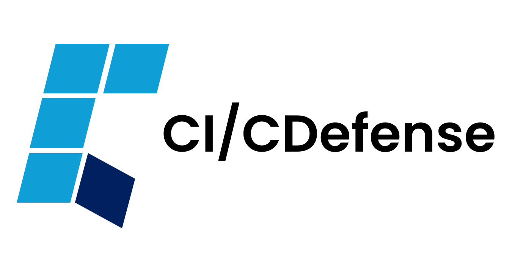
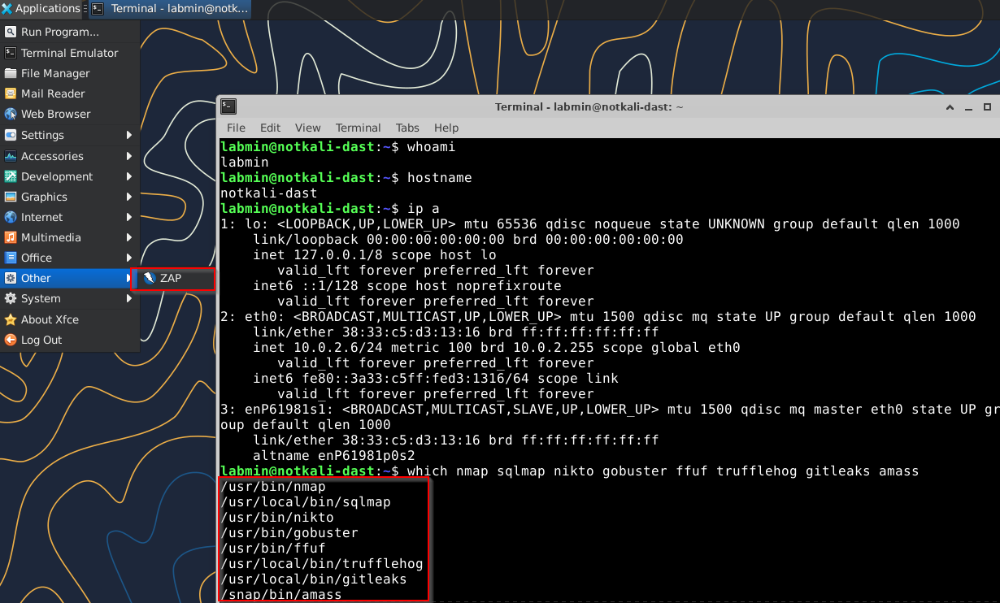
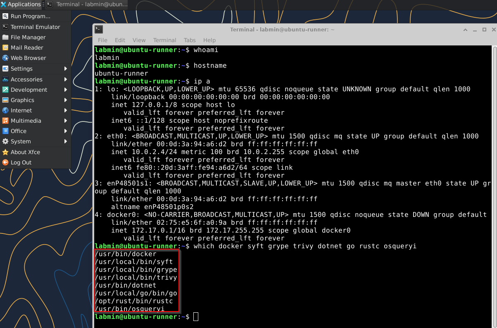
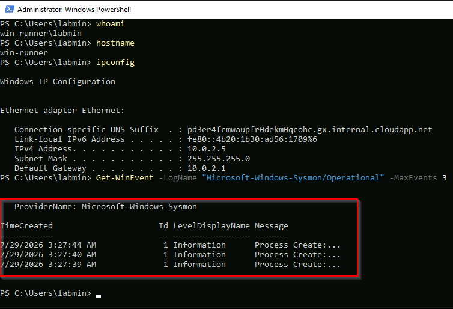

# CI/CDefense

**Practice software supply chain security with CI/CDefense!**

If you've looked at a cybersecurity bulletin in the last few years, you'd know the software supply chain has been under steady attack for quite some time. Since I feel like it's imperative to learn how to defend your own CI/CD pipeline, I started this project. 

With this, you can build your own Azure lab for CI/CD pipeline and software supply chain security testing.

## Lab Architecture

This has three VMs on a private network, reachable only through a managed jump host. No VM has a public IP.

- **Ubuntu (latest LTS)**: primary CI runner, equivalent to a self-hosted GitLab Runner or GitHub Actions runner
- **Windows Server 2022 Datacenter**: secondary runner for Windows binaries and .NET builds
- **notkali**: Ubuntu-based adversary and DAST node, loaded with offensive tooling for simulating supply chain attacks and scanning for exposed secrets

Network posture:

- VMs can reach each other
- VMs can reach the internet (egress allowed for package and model pulls)
- Nothing on the internet can reach the VMs (no ingress)
- Operator access is via Azure Bastion (**Note:** Standard SKU is an *intentional* choice. This is required if you want to be able to directly connect to the Linux hosts via RDP in the Azure portal!)

## What Gets Built

Azure (17 resources):

- Resource group, virtual network, workload subnet, AzureBastionSubnet
- Network security group with least-privilege rules, plus subnet association
- Azure Bastion host and its static public IP
- 3 network interfaces, no public IPs
- 3 virtual machines (all Ubuntu 24.04 except the Windows runner)
- 3 VM extensions that install desktops and tooling

## Prerequisites

- Terraform CLI 1.9 or newer
- Azure CLI
- An Azure subscription with billing enabled
- Git

### Optional but recommended

**Note:** These will have to be manually created/configured.

- VS Code with the HashiCorp Terraform extension
- Multiple dummy accounts
  - GitHub
  - Azure
  - CircleCI

## Validated Lab

### notkali (adversary / DAST node)



Confirms: `labmin` login, `notkali-dast` hostname, private IP `10.0.2.6` (no public IP), XFCE desktop over Bastion (RDP), ZAP installed, and the offensive toolchain resolving on PATH (nmap, sqlmap, nikto, gobuster, ffuf, trufflehog, gitleaks, amass).

### Ubuntu (CI runner)



Confirms: `ubuntu-runner`, private IP `10.0.2.4`, XFCE desktop over Bastion (RDP). The backgrounded systemd install completed — Docker (note the running `docker0` bridge), Syft, Grype, Trivy, .NET, Go, Rust, and osquery all resolve on PATH, proving the deferred-install pattern works.


### Windows (secondary runner)



Confirms: `win-runner`, private IP `10.0.2.5`, and Sysmon actively logging Process Create (Event ID 1) events to the Operational log via the SwiftOnSecurity config.


## Quick Start

### 1. Authenticate

```powershell
az login
az account show --query id --output tsv
```

Copy the subscription GUID that prints.

### 2. Create your variables file

`terraform.tfvars` is gitignored and is not in this repo. Create it from the template:

```powershell
copy terraform.tfvars.example terraform.tfvars
```

Then fill in:

- `subscription_id` — the GUID from step 1
- `location` — defaults to `centralus`
- `admin_username` — cannot be admin, administrator, root, guest, user, or test
- `admin_password` — 12+ characters, mixed case, number, symbol

To keep the password off disk, set it as an environment variable instead and omit it from the file:

```powershell
$env:TF_VAR_admin_password = "your-password-here"
```

### 3. Deploy

```powershell
terraform init
terraform validate
terraform plan
terraform apply
```

Expect 20 to 40 minutes. Bastion takes 5 to 10 minutes on its own, and the notkali extension installs a substantial offensive toolset.

### 4. Connect

```powershell
terraform output
```

In the Azure Portal, go to the resource group, select a VM, then Connect, then Bastion. Sign in with your admin username and password.

All three VMs accept RDP. xrdp is installed on the Linux nodes so they present a graphical desktop rather than a bare shell. For Linux VMs, in the Bastion Connect pane select Protocol: RDP, port 3389 (enabled by the Standard SKU). Native-client tunneling via az network bastion tunnel + mstsc also works.

### Connecting via the native RDP client (PowerShell tunnel)

The Bastion Connect pane in the portal works for both Windows (RDP) and Linux (RDP via the Standard SKU protocol option). If you'd rather use a local RDP client — for clipboard sharing, file transfer, or multi-monitor — open a Bastion tunnel from PowerShell and connect through it.

Requires the Bastion **Standard** SKU with `tunneling_enabled = true` (both are
set in `bastion.tf`).

Open a tunnel to a VM. Leave this window running — it holds the tunnel open:

```powershell
az network bastion tunnel `
  --name cicdefense-bastion `
  --resource-group cicdefense-rg `
  --target-resource-id "<VM_RESOURCE_ID>" `
  --resource-port 3389 `
  --port 13389
```

Get the VM's resource ID with:

```powershell
az vm show --resource-group cicdefense-rg --name cicdefense-ubuntu --query id --output tsv
```

Then, in a second window, launch Remote Desktop against the local tunnel port:

```powershell
mstsc /v:localhost:13389
```

Log in with your `admin_username` and `admin_password`. For a second VM, open another
tunnel on a different local port (e.g. `--port 13390`) so both can run at once.

### 5. Teardown

```powershell
terraform destroy
```

Do this at the end of every session.

## Installed Tooling

Provisioning scripts live in `scripts/` and run automatically via VM extensions.

On the Ubuntu runner, heavier toolchains and scanners install in the background after first boot via a systemd one-shot unit, so the deployment finishes quickly. If a tool isn't present immediately after you connect, it's still installing; check `/var/log/cicdefense-detection-install.log`.

All nodes:

- git
- VS Code
- Ollama

Ubuntu (primary CI runner):

- XFCE desktop and xrdp
- Build toolchains: build-essential (gcc/g++/make), Python (pip, venv)
- Backgrounded toolchains: Docker CE, Node.js/npm, JDK + Maven, .NET SDK 8.0, Go, Rust
- Detection: auditd (with ruleset), osquery, Wireshark, mitmproxy
- SBOM and vulnerability scanning: Syft, Grype, Trivy

Windows Server 2022 (secondary runner for Windows-specific test cases, installed via direct download, no package manager):

- git, VS Code, Ollama
- .NET SDK 8.0, Node.js
- Detection: Sysmon (with SwiftOnSecurity config), Procmon, Autoruns, Regshot
- IE Enhanced Security Configuration disabled
- C++ build tools (MSVC) are NOT provisioned — the Visual Studio Build Tools install is large and slow. Install manually if needed: `winget install Microsoft.VisualStudio.2022.BuildTools`

notkali (adversary / DAST node):

- XFCE desktop and xrdp
- Recon and OSINT: nmap, masscan, dnsrecon, amass (via snap), whatweb, theHarvester
- Web app testing: sqlmap, nikto, gobuster, ffuf, wfuzz, OWASP ZAP
- Secrets scanning: trufflehog, gitleaks
- Traffic: Wireshark, mitmproxy
- Burp Suite Community is downloaded to the Downloads folder but not installed. You'll have to install it yourself if you want it

### Language models

Ollama is installed but models are not pulled during provisioning, since the downloads are large enough to risk timing out the extension. Pull them after first login:

```bash
ollama pull gemma4:e4b
ollama pull R4C3R/minicpm5-1b-fable5-heretic
```

I chose these because they fit my intended use case, but of course you can choose whatever you want for this lab.

The default `Standard_D2s_v5` size (2 vCPU, 8 GB RAM) runs small models comfortably. Bump `vm_size` in `terraform.tfvars` for more headroom.

## Cost

This lab bills by the hour. Destroy it when you are not using it for your sanity.

Roughly $0.55 to $0.65 USD per hour in centralus, broken down as:

- 3 D2s_v5 VMs, about $0.10/hr each region-dependent
- Azure Bastion Standard SKU, about $0.29
- OS disks (64 GB StandardSSD on the Linux nodes), a few cents per hour
- Static public IP, about $0.005

Free: resource group, virtual network, subnets, and network security group

Verify against the Azure pricing calculator for your region and subscription.

Notes:

- Bastion bills simply for existing, whether or not you are connected through it
- OS disks bill even while a VM is stopped; stopping is not the same as destroying
- `terraform destroy` removes everything, including disks

A four-hour session costs a few dollars. A forgotten week costs around $100 USD.

## Security Notes

Please keep in mind that this is a lab. I deliberately chose convenience over hardening for several things:

- The Windows provisioning script is fetched from a public GitHub raw URL (raw.githubusercontent.com/.../win-setup.ps1) at deploy time and executed. It's pinned to a branch, not a commit, so the same config can pull a different script over time. This is literally a live example of the remote-fetch supply-chain risk this lab studies.
- Password authentication is enabled on the Linux VMs. SSH keys are the commonly accepted security practice. This is defensible only because the VMs have no public IP and are reachable solely through Bastion. To switch, replace `disable_password_authentication = false` with an `admin_ssh_key` block.
- Terraform state contains secrets in plaintext. Marking a variable sensitive only redacts it from console output. State files are gitignored, but a production setup would use a remote backend with encryption at rest and state locking.
- Provisioning scripts use curl piped to shell. The Ollama installer executes a remote script unreviewed. This is the standard install path and TBH, a live example of the type of thing this lab is meant to study, among other configurations in this section.
- Several offensive tools on notkali are installed from vendor install scripts and GitHub release binaries rather than signed distro packages. This is convenient and common, and it is also exactly the kind of unverified-supply-chain step this lab exists to study.
- Image versions are set to `latest` rather than pinned. This is done only for convenience. The end result is that the same configuration produces different images over time. If you want completely reproducible builds, pin the exact version you want.
- Egress is unrestricted. Adding outbound deny rules to the NSG is the natural next hardening exercise, and it is the control that would stop a compromised runner from exfiltrating secrets.

Never commit `terraform.tfvars` or `.tfstate` files. Both are gitignored at the repo root.

## Troubleshooting

**terraform plan prompts for a variable.** A required variable has no value. Check that `terraform.tfvars` exists and is filled in.

**Subscription ID is not known by Azure CLI.** The GUID in `terraform.tfvars` does not match your logged-in session. Run `az account list --all --output table` and compare. Also confirm you are logged into the correct account, especially if you use more than one.

**SkuNotAvailable or NotAvailableForSubscription.** Your regional vCPU quota is likely zero or too low, or the VM size family is not offered to your subscription in that region. Check with `az vm list-usage --location <region> --output table` and look at the Limit column. Fix by requesting a quota increase (Portal, search Quotas, Compute) or by choosing a region or size that is available to your subscription.

**Marketplace offer removed for new purchase.** The image was withdrawn from the Marketplace (this is why the adversary node is stock Ubuntu plus tooling rather than the official Kali image). Use a stock image and install tooling via the provisioning script instead.

**PlatformImageNotFound.** A marketplace image reference has drifted. Verify with:

```powershell
az vm image list --publisher <publisher> --offer <offer> --location centralus --all --output table
```

**Bastion Connect pane only shows SSH for a Linux VM.** The RDP protocol option requires the Bastion **Standard** SKU (or higher). On the Basic SKU, the portal only offers SSH for Linux VMs, so you get a terminal instead of the XFCE desktop. Set `sku = "Standard"` on the `azurerm_bastion_host` resource and re-apply. The SKU can be upgraded in place (no rebuild).

**`az network bastion tunnel` fails: "Bastion Host SKU must be Standard or Premium and Native Client must be enabled."** Same root cause as above. Native-client tunneling needs the Standard (or Premium) SKU **and** `tunneling_enabled = true` on the `azurerm_bastion_host` resource. Set both and re-apply, then re-run the tunnel command.

**Extension fails with "VM has reported a failure".** Terraform cannot see inside the script. Connect via Bastion and read the logs. On Linux, `/var/log/azure/custom-script/handler.log`. On Windows, read stderr under `C:\Packages\Plugins\Microsoft.Compute.CustomScriptExtension\*\Downloads\`.

**Blank grey screen after RDP to a Linux VM.** The `.xsession` file is missing or has the wrong owner. Check that the setup script wrote it for the correct user.

**templatefile error: "vars map does not contain key ...".** A provisioning script uses a bash variable with brace syntax (`${VAR}`), which collides with Terraform's `templatefile()` interpolation. Escape it as `$${VAR}` so Terraform passes it through to bash. Only `${admin_username}` should remain single-dollar (that one is meant to be injected by Terraform).

**OWASP ZAP missing on notkali.** ZAP installs via snap, and snapd is sometimes not ready during first-boot provisioning, so the install can silently fail (it's non-fatal by design). If ZAP isn't present, re-run `sudo snap install zaproxy --classic` after connecting.

**Windows extension fails with a 404 / "failed to download the blob".** The Windows extension fetches `scripts/win-setup.ps1` from the public GitHub raw URL at deploy time. If you edited the script but didn't push, or the filename in `extensions.tf` (`fileUris` + `-File`) doesn't match the actual file, the download 404s. Confirm the raw URL resolves in a browser before applying, and make sure the file, the `fileUris` URL, and the `commandToExecute -File` argument all say `win-setup.ps1`.

**Nothing else works.** Turn on debug logging:

```powershell
$env:TF_LOG = "DEBUG"
terraform plan
$env:TF_LOG = ""
```

## Roadmap

- [x] Detection and logging layer: Sysmon on Windows; auditd and osquery on the runners; SBOM and vulnerability scanning with Syft, Grype, and Trivy
- [ ] Seeded vulnerable pipeline for attack scenarios (this is where the CircleCI/GitHub dummy accounts come in)
- [ ] Remote state backend with locking
- [ ] Egress filtering exercise
- [ ] Pinned image versions for reproducible builds
- [ ] Central log aggregation so detection events from all three VMs land in one place

## License

Free-for-all, aka MIT.